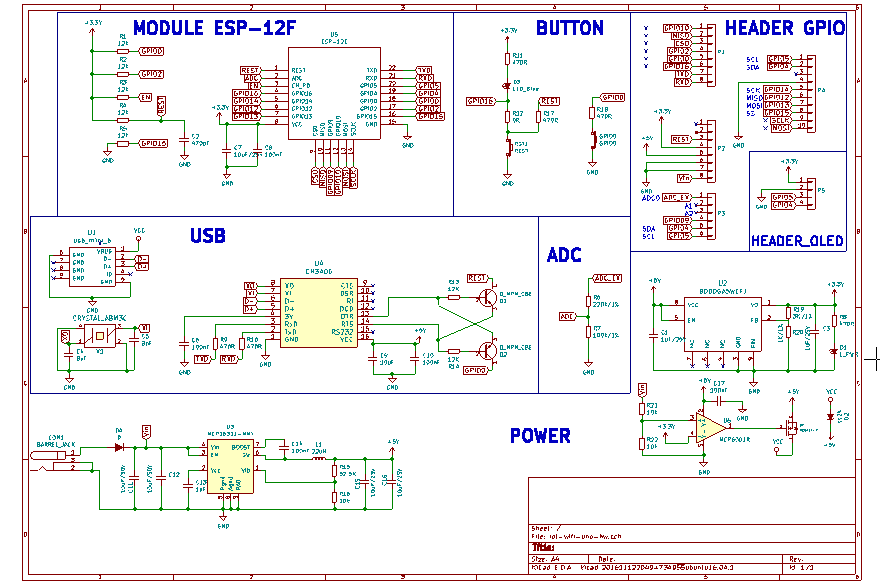
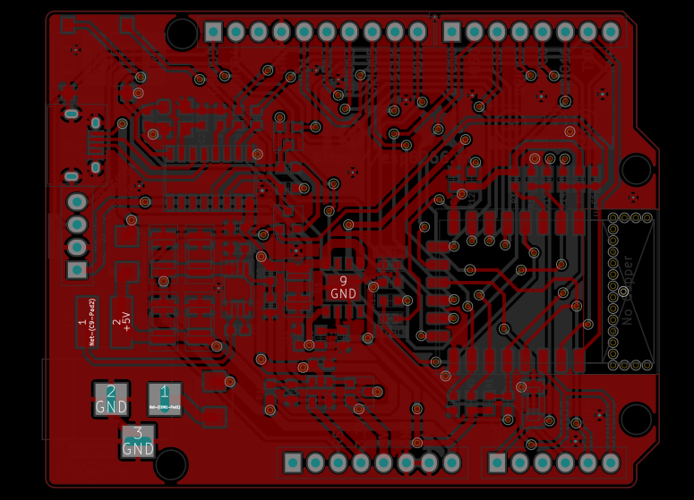
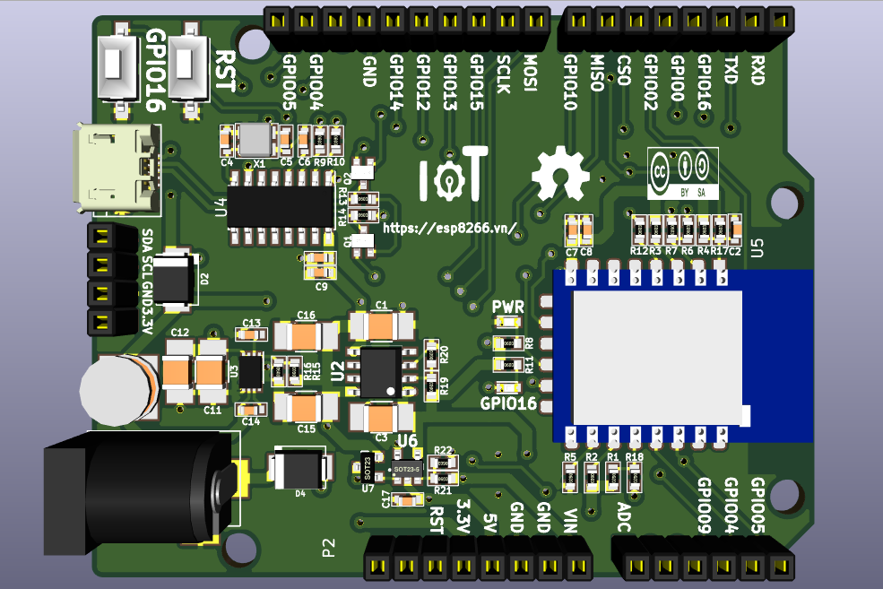
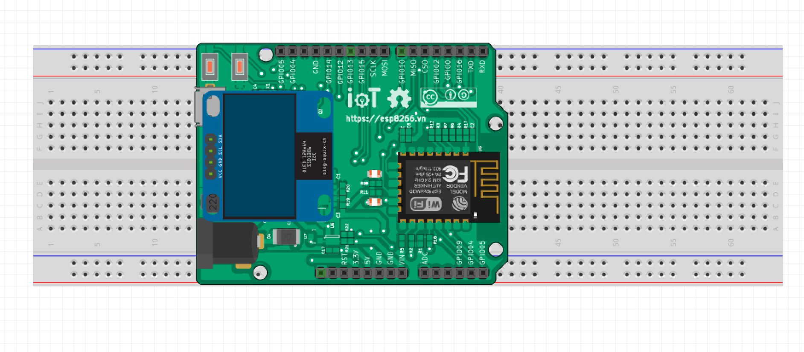

# iot-wifi-uno-hw

## Features

ESP8266 as Controller compatible with Arduino Uno:  
- Power input 5.5V to 28VDC (1.2A/5V output) and 5V USB
- Automatic enter program mode via Serial - Pre-program OTA firmware
- [ESP8266 Arduino](https://github.com/esp8266/Arduino) and Arduino Library
- Vietnamese doc support from https://esp8266.vn
- Additional Button and LED same NodeMCU.
- Open hardware with CC-BY-SA license
- Design with KiCad

## Hardware

### Schematics

### PCB Layout

### 3D

### Pinout 

### Fritzing part 

 

### Gerber

[Download](./assets/wifi-uno-hw.zip)

### BOM 

| Designator | Package | Quantity | Designation  |
|-----------------------------------|--------------------------------|----------|--------------|
| U1                                | USB_Micro-B                    | 1        | usb_mini_b   |
| U2                                | MSOP-8_3x3mm_Pitch0.65mm       | 1        | MCP16311-MNY |
| U3                                | SOIC-16_3.9x9.9mm_Pitch1.27mm  | 1        | CH340G       |
| U4                                | ESP-12F                        | 1        | ESP-12E      |
| U5                                | SOT-23-5                       | 1        | MCP6001R     |
| U6                                | HTSOP-J8                       | 1        | BD00GA5WEFJ  |
| U7                                | SOT-23                         | 1        | IRLM6402     |
| D1,D3                             | do214aa                        | 2        | SS24         |
| D2                                | LED_0603                       | 1        | LED_Blue     |
| D4                                | LED_0603                       | 1        | L_PWR_VANG   |
| D5                                | SOD-80                         | 1        | ZENER_3.3V   |
| X1                                | Crystal_SMD_3225_4Pads         | 1        | 12MHz        |
| Q1,Q2                             | SOT-23                         | 2        | MMBT8050LT1G |
| L1                                | Choke_SMD_Wuerth-WE-PD2-Typ-MS | 1        | 22uH         |
| CON1                              | BARREL_JACK                    | 1        | BARREL_JACK  |
| C3,C4.C10,C11                     | C_1210                         | 4        | 10uF/50V     |
| C13                               | C_1210                         | 1        | 1uF/25V      |
| C1,C2                             | C_0603                         | 2        | 22pF         |
| C15,C7                            | C_0603                         | 2        | 1uF/25V      |
| C6,C8,C9,C12,C14,C5               | C_0603                         | 6        | 100nF        |
| R1,R2,R3,R4,R5,R9,R18,R19,R10,R11 | R_0603                         | 10       | 10k          |
| R6,R7,R12,R14,R17,R22             | R_0603                         | 6        | 470R         |
| R8                                | R_0603                         | 1        | 52.5K        |
| R13                               | R_0603                         | 1        | 0R           |
| R15                               | R_0603                         | 1        | 220k/1%      |
| R16                               | R_0603                         | 1        | 100k/1%      |
| R20                               | R_0603                         | 1        | 3K/1%        |
| R21                               | R_0603                         | 1        | 1K/1%        |
| P5                                | Pin_Header_Straight_1x04       | 1        | CONN_01X04   |
| P2,P1                             | Pin_Header_Straight_1x08       | 2        | CONN_01X08   |
| P3                                | Pin_Header_Straight_1x06       | 1        | CONN_01X06   |
| P4                                | Pin_Header_Straight_1x10       | 1        | CONN_01X10   |

### Remark

This project was in development phase - we will remove this remark after release

# License

